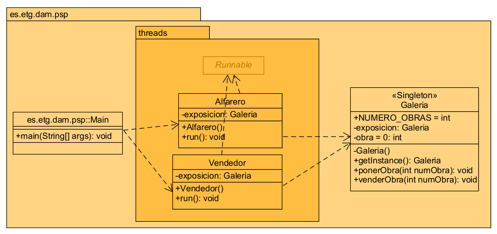

# Galería de arte
---
https://github.com/AmandaSMZ/galeriaArte.git

## Análisis

El sistema está basado en un patrón de **Productor-Consumidor**, donde el **Alfarero** coloca una obra de cerámica en una galería de exposición y el **Vendedor** vende la obra. Ambos deben interactuar de manera sincronizada para que el vendedor solo pueda vender la obra una vez que ha sido colocada por el alfarero, y el alfarero solo puede colocar una nueva obra cuando la anterior ha sido vendida.

El sistema debe garantizar que no haya condiciones de carrera, es decir, que el alfarero y el vendedor no intenten modificar el estado de la galería de manera simultánea. Para ello, se utiliza **sincronización** con los métodos `wait()` y `notify()` de los hilos en Java.

### Requisitos Funcionales

1. **Colocación de la obra por el alfarero**: El alfarero debe colocar una obra en la galería cuando la galería esté vacía.
2. **Venta de la obra por el vendedor**: El vendedor debe vender la obra de la galería solo cuando haya una obra disponible para la venta.
3. **Sincronización de las acciones**: El sistema debe garantizar que el alfarero no pueda colocar una nueva obra hasta que la anterior haya sido vendida y que el vendedor no pueda vender una obra si no está disponible.
4. **Manejo de múltiples obras**: El sistema debe gestionar la colocación y venta de un número específico de obras (en este caso, 10).
5. **Instancia única de la galería**: La galería debe ser una única instancia (utilizando el patrón Singleton) para garantizar que solo haya una galería para gestionar todas las obras.

### Requisitos No Funcionales

1. **Rendimiento**: El sistema debe permitir la colocación y venta de 10 obras sin bloqueos innecesarios o caídas de rendimiento.
2. **Escalabilidad**: Aunque el sistema está diseñado para 10 obras, debe poder ampliarse para manejar más obras si fuera necesario sin modificaciones significativas.
3. **Seguridad**: El sistema debe evitar condiciones de carrera y bloqueos utilizando mecanismos adecuados de sincronización (como `wait()` y `notify()`).
4. **Mantenibilidad**: El código debe ser fácil de entender y mantener, utilizando buenas prácticas de programación y patrones de diseño (como Singleton).
5. **Usabilidad**: La interacción entre el alfarero y el vendedor debe ser clara y garantizar que las operaciones de colocación y venta de las obras se realicen sin errores.

## Diseño

### Clases

1. **Galería**:
   - Utiliza el patrón **Singleton** para asegurar que solo haya una instancia de la galería.
   - Utiliza `synchronized` para garantizar que las operaciones de poner y vender una obra estén coordinadas.

2. **Alfarero**:
   - Hilo que coloca una obra en la galería.

3. **Vendedor**:
   - Hilo que vende una obra de la galería.

4. **Main**:
   - Punto de entrada al programa donde se crean y lanzan los hilos del alfarero y vendedor.

### Diagrama de Clases

### Elementos Relevantes de la Codificación

1. **Patrón Singleton**:
   - En la clase `Galeria`, la instancia de la galería se gestiona de manera única a través de un método estático `getInstance()`. Esto garantiza que no haya múltiples instancias de la galería.

2. **Sincronización de Hilos**:
   - Se usan los métodos `synchronized`, `wait()` y `notify()` para gestionar la interacción entre los hilos. El alfarero pone la obra en exposición, pero si la galería ya tiene una obra (es decir, `this.obra == 1`), el alfarero espera. Lo mismo sucede con el vendedor, quien debe esperar hasta que haya una obra en la galería para poder venderla.

## Métodos de Prueba

Para garantizar el correcto funcionamiento del sistema, se diseñaron y ejecutaron los siguientes casos de prueba:

---
### 1. Test Singleton

#### Objetivo
Verificar que la clase `Galeria` implemente correctamente el patrón Singleton, asegurando que solo exista una única instancia durante la ejecución del programa.

#### Resultado Esperado
Todas las referencias a la galería deben apuntar al mismo objeto en memoria.

---

### 2. Test de Coordinación entre Alfarero y Vendedor

#### Objetivo
Comprobar la correcta coordinación entre los hilos que representan al **alfarero** y al **vendedor**. Esto implica que:
- El alfarero no puede colocar una nueva obra hasta que el vendedor haya vendido la obra actual.
- El vendedor no puede vender una obra si no hay ninguna en exposición.

#### Resultado Esperado
Después de ejecutar ambos hilos, el estado de la galería debe reflejar que no hay obras en exposición, ya que el vendedor debe haber vendido la obra colocada por el alfarero.

---

### Conclusión

Los tests aseguran que:
1. La implementación de la clase `Galeria` respeta el patrón de diseño Singleton.
2. El comportamiento concurrente entre los hilos funciona correctamente, asegurando que el flujo de colocación y venta de obras sigue las restricciones definidas.

El sistema es funcional y robusto frente a las condiciones probadas.
